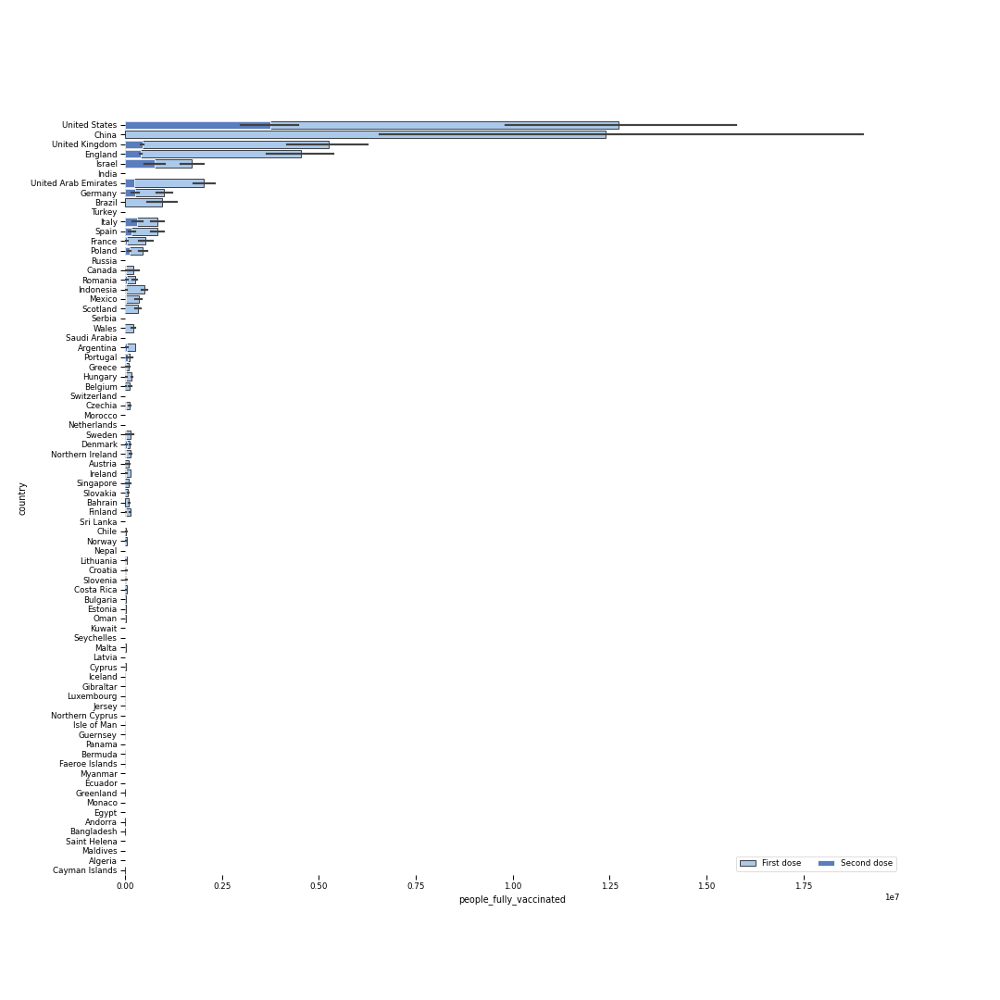

Visualisation of Covid database, available at https://www.kaggle.com/gpreda/covid-world-vaccination-progress


```python

import pandas as pd
from pandas_profiling import ProfileReport
from IPython.display import HTML

df = pd.read_csv("country_vaccinations.csv")

profile = ProfileReport(df)

#If you want an html report 
#profile.to_file(output_file='rapport.html')

HTML(filename="rapport.html")

```
https://github.com/b5419/Covid_vaccination/blob/main/rapport.html


```python
df['iso_code'].fillna('GBR', inplace=True)
df.fillna(0, inplace=True)
df['date'] = pd.to_datetime(df['date'])
df = df.sort_values('date', ascending=True)
df['date'] = df['date'].dt.strftime('%m-%d-%Y')


import plotly.express as px
fig = px.choropleth(df,                            # Input Dataframe
                     locations="iso_code",           # identify country code column
                     color="total_vaccinations",                     # identify representing column
                     hover_name="country",              # identify hover name
                     animation_frame="date",        # identify date column
                     projection="natural earth",        # select projection
                     color_continuous_scale= 'Bluered_r',  # select prefer color scale
                     range_color=[0,5000000])             # select range of dataset     
fig.show()          
fig.write_html("example_map.html")            


#from IPython.display import IFrame
#IFrame(src='example_map.html', width=700, height=600)

```

https://github.com/b5419/Covid_vaccination/blob/main/example_map.html

```python
import numpy as np
import pandas as pd
import matplotlib.pyplot as plt
import seaborn as sns
 
sns.set_context('paper')

crashes = df.sort_values(by = ["total_vaccinations"], ascending=False)
fig, ax = plt.subplots(figsize = (15,15))
sns.set_color_codes('pastel')
sns.barplot(x = 'people_vaccinated', y = 'country', data = crashes,
            label = 'First dose', color = 'b', edgecolor = 'k')
sns.set_color_codes('muted')
sns.barplot(x = 'people_fully_vaccinated', y = 'country', data = crashes,
            label = 'Second dose', color = 'b', edgecolor = 'w')
ax.legend(ncol = 2, loc = 'lower right')
sns.despine(left = True, bottom = True)
plt.show()
```



```python
import matplotlib.pyplot as plt
dat = df.sort_values(by = ["date"], ascending = True)
fig, ax = plt.subplots(2,2, figsize=(10, 10))

ax[0, 0].plot(dat.loc[dat["iso_code"]=="USA","date"], dat.loc[dat["iso_code"]=="USA","daily_vaccinations_per_million"],"b.")
ax[0, 0].set_title('USA')
ax[0, 1].plot(dat.loc[dat["iso_code"]=="CHN","date"], dat.loc[dat["iso_code"]=="CHN","daily_vaccinations_per_million"],"r.")
ax[0, 1].set_title('China')
ax[1, 0].plot(dat.loc[dat["country"]=='United Kingdom',"date"], dat.loc[dat["country"]=='United Kingdom',"daily_vaccinations_per_million"],".", color="orange")
ax[1, 0].set_title('United Kingdom')
ax[1, 1].plot(dat.loc[dat["iso_code"]=="FRA","date"], dat.loc[dat["iso_code"]=="FRA","daily_vaccinations_per_million"],".", color="green")
ax[1, 1].set_title('France')
# rotate and align the tick labels so they look better
ax[0,0].set_xticks(ax[0,0].get_xticks()[::5])
ax[0,1].set_xticks(ax[0,1].get_xticks()[::5])
ax[1,0].set_xticks(ax[1,0].get_xticks()[::5])
ax[1,1].set_xticks(ax[1,1].get_xticks()[::5])
fig.autofmt_xdate()


for ax in ax.flat:
    ax.set(xlabel='date', ylabel='daily_vaccinations_per_million')

for ax in fig.get_axes():
    ax.label_outer()
```
